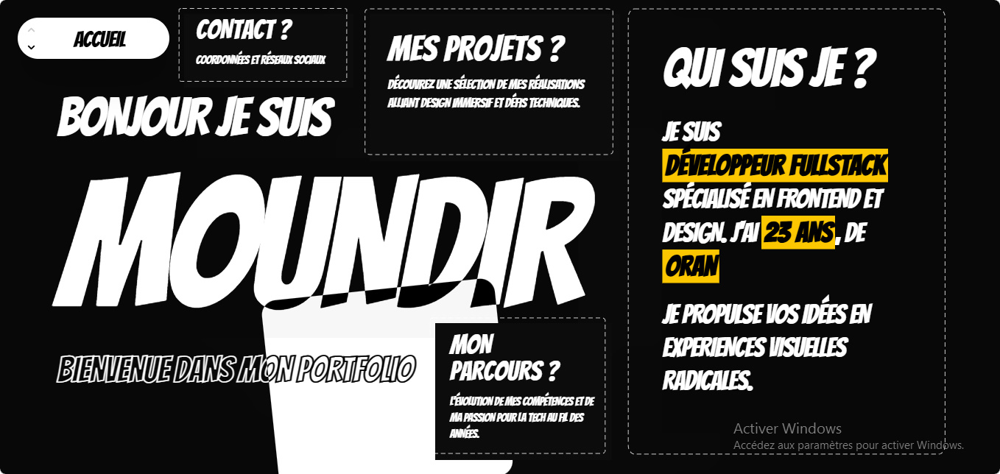

<p align="center">
  
</p>

<h1 align="center">
  
</h1>

<p align="center">
  <strong>Un portfolio pensé comme une expérience, pas comme une page web.</strong><br/>
  Un rail plein écran où chaque section est un lieu à part entière — sa propre couleur, sa propre intro, sa propre logique d'interaction.
</p>

<p align="center">
  
  
  
  
  
</p>

---

## Sommaire

- [Le concept](#le-concept)
- [Système de navigation](#système-de-navigation)
- [Les sections](#les-sections)
- [Système de design](#système-de-design)
- [Architecture technique](#architecture-technique)
- [Structure du projet](#structure-du-projet)
- [Installation](#installation)
- [Performance](#performance)
- [Feuille de route](#feuille-de-route)

---

## Le concept

Ce portfolio ne scroll pas comme un site classique. C'est un **rail plein écran** : chaque section occupe exactement `100dvh`, et on passe de l'une à l'autre par une translation verticale animée (`motion.main` + `transform: translateY`), pilotée par un hook maison plutôt que par le scroll natif du navigateur.

L'objectif : que chaque section se ressente comme un **lieu** qu'on visite — avec sa propre intro, sa propre couleur, sa propre logique d'interaction — plutôt qu'un simple bloc de contenu qu'on traverse.

Chaque section s'ouvre avec un **overlay d'introduction** : une grille de cases qui se remplissent progressivement d'une phrase (déclinée en plusieurs langues) avant de révéler une icône, puis le contenu réel. Cet overlay ne se rejoue qu'une seule fois par visite grâce à `useInView({ once: true })`.

## Système de navigation

La navigation est centralisée dans une **pill flottante** en haut à gauche de l'écran (`Navbar.jsx`), toujours visible, quel que soit le breakpoint.

- **`ColorSweep`** — quand on change de section, la pill ne change pas de couleur d'un coup : un balayage en 4 bandes diagonales traverse le fond pour transitionner vers la couleur de la nouvelle section, avec un léger décalage temporel entre bandes internes/externes pour un effet plus organique qu'un simple fade
- **`SlotReel`** — le libellé de la section ne se contente pas non plus d'un fade : il tourne comme un tambour de machine à sous, dans la direction correspondant au sens de navigation (haut ↔ bas)
- **`NavHint`** — au bout de 4 secondes d'inactivité, une bulle d'aide apparaît une fois pour expliquer l'usage des flèches / scroll / swipe, et se referme automatiquement après 6 secondes (ou au clic)
- La couleur et le contraste du texte (`text: "dark" | "light"`) sont définis **par section** dans `App.jsx`, et la navbar s'adapte automatiquement à chacune

Sur desktop, la navigation répond à la molette et au clavier (`ArrowUp/Down`, `PageUp/Down`). Sur mobile, elle passe entièrement par la navbar — pas de scroll natif, pour garder le contrôle total sur le rythme des transitions.

## Les sections

| # | Section | Interaction propre |
|---|---|---|
| 1 | **Accueil** | Parallax souris/tactile sur une plaque en `mix-blend-difference`, cartes de navigation révélées au survol |
| 2 | **Qui suis-je** | Carte de parcours académique paginée, grille de compétences façon touches de clavier mécanique |
| 3 | **Projets** | Cartes scattered en desktop, carrousel avec rotation automatique + galerie plein écran en mobile |
| 4 | **Archives** | Disposition façon polaroids éparpillés, avec vue focus au clic |
| 5 | **Parcours** | Carte au trésor interactive : étapes reliées par un tracé en courbes de Bézier, révélées au survol/tap |
| 6 | **Contact** | Formulaire fonctionnel (EmailJS), carte mail à copie rapide, réseaux sociaux en "touches" physiques |

Chaque section suit la même mécanique en trois temps : **overlay d'intro → apparition du titre géant → révélation du contenu en cascade**, avec des timings et un vocabulaire visuel légèrement différents pour ne jamais donner une impression de répétition.

## Système de design

| Élément | Valeur |
|---|---|
| Fond | `#080808` sur l'intégralité du site |
| Typographie display | `Bangers` (`font-cartoon`) pour tous les titres — effet affiche/BD assumé |
| Couleurs par section | jaune `#facc15` · rouge `#ef4444` · gris `#6b7280` · vert `#22c55e` · bleu `#3b82f6` |
| Grille de fond | carrés en pointillés, tournés à -35°, teintés selon la section active |
| `AnimatedFrame` | cadre SVG en pointillés qui change de couleur au survol, réutilisé sur la quasi-totalité des cartes |
| `BandsFill` | balayage 4-bandes en diagonale, signature de hover sur les blocs interactifs |
| Overlay d'intro | grille → phrases multilingues → icône symbolique de la section |

## Architecture technique

**`App.jsx`** orchestre l'ensemble :
- La liste des sections est déclarée comme un tableau de configuration (`id`, `label`, `Component`, `color`, `text`) — ajouter une section revient à ajouter une entrée, sans toucher au reste de la logique
- Le rail (`motion.main`) se déplace via `animate={{ y: -index * 100% }}`, avec une easing custom (`cubic-bezier(0.65, 0, 0.35, 1)`) pour un mouvement qui accélère puis ralentit franchement plutôt qu'un ease générique
- Chaque section inactive reçoit `opacity: 0.35`, `scale: 0.96` et un léger `blur` — pour que le contenu voisin reste perceptible sans distraire, façon carrousel
- `contentVisibility: "auto"` sur les sections non actives, combiné à `containIntrinsicSize`, pour que le navigateur puisse sauter leur calcul de layout/paint tant qu'elles ne sont pas visibles

**`useFullPageScroll`** (hook custom) :
- Écoute `wheel` et `keydown` uniquement sur desktop (au-delà d'un breakpoint défini) ; le mobile garde son propre système de navigation via la navbar
- Accumule le delta de la molette et ne déclenche un changement de section qu'au-delà d'un seuil, avec réinitialisation si le geste s'arrête (`> 200ms` sans event) — pour éviter qu'un simple frémissement de trackpad ne fasse défiler plusieurs sections d'un coup
- Verrouille la navigation pendant la durée de la transition (`isAnimating`) pour empêcher tout chevauchement d'animations

**`useIsDesktop`** : détecte le breakpoint via `matchMedia`, utilisé pour adapter le comportement de la navbar et du scroll selon le device.

## Structure du projet

```
portfolio/
├── public/
│   └── Logo.png                 # Logo utilisé dans ce README et le favicon
└── src/
    ├── App.jsx                  # Orchestration du rail plein écran + config des sections
    ├── hooks/
    │   ├── useFullPageScroll.js  # Navigation wheel/clavier desktop, verrouillage anti-chevauchement
    │   └── useIsDesktop.js       # Détection de breakpoint
    ├── components/
    │   ├── Navbar.jsx             # Pill flottante : ColorSweep, SlotReel, NavHint
    │   ├── SlotReel.jsx           # Effet tambour pour le libellé de section
    │   ├── Hero.jsx
    │   ├── About.jsx
    │   ├── ProjectsHolder.jsx
    │   ├── ProjectCard.jsx
    │   ├── Evolution.jsx
    │   ├── ArchiveHolder.jsx
    │   ├── ArchiveCard.jsx
    │   └── Contact.jsx
    └── assets/                    # Médias (images, vidéos de preview, readme1.png)
```

## Installation

```bash
git clone <url-du-repo>
cd <nom-du-dossier>
npm install
npm run dev
```

Build de production :
```bash
npm run build
```

Le formulaire de contact utilise EmailJS. Les identifiants (`SERVICE_ID`, `TEMPLATE_ID`, `PUBLIC_KEY`) se trouvent dans `Contact.jsx` — à déplacer en variables d'environnement (`.env` + `import.meta.env.VITE_...`) si le repo doit rester public avec des clés propres.

## Performance

Le fond en grille pointillée de chaque section était initialement composé de ~160 `<div>` React générés à chaque montage. Il a été remplacé par un motif SVG unique répété nativement en `background-image` CSS : rendu visuel identique, coût de calcul quasi nul. Ce point était particulièrement sensible sur mobile, où les versions desktop et mobile de chaque section restent montées en parallèle dans le DOM (masquées en CSS via `hidden`/`md:hidden`) tant qu'un rendu conditionnel via `useIsDesktop` n'est pas en place à ce niveau.

## Feuille de route

- [ ] Rendu conditionnel desktop/mobile par section (éviter le double montage des deux versions)
- [ ] Variables d'environnement pour les clés EmailJS
- [ ] Lazy loading des assets vidéo hors-écran

---

<p align="center">
  <strong>Moundir Bechikh</strong> — Développeur fullstack, Oran, Algérie<br/>
  <sub>Master 2 SITW — Université Oran 1 Ahmed Ben Bella</sub>
</p>